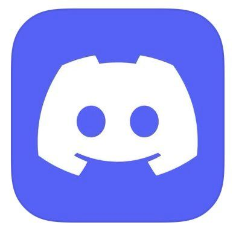

<div id="top"></div>
<!--
*** Thanks for checking out the Best-README-Template. If you have a suggestion
*** that would make this better, please fork the repo and create a pull request
*** or simply open an issue with the tag "enhancement".
*** Don't forget to give the project a star!
*** Thanks again! Now go create something AMAZING! :D
-->


<!-- PROJECT SHIELDS -->
<!--
*** I'm using markdown "reference style" links for readability.
*** Reference links are enclosed in brackets [ ] instead of parentheses ( ).
*** See the bottom of this document for the declaration of the reference variables
*** for contributors-url, forks-url, etc. This is an optional, concise syntax you may use.
*** https://www.markdownguide.org/basic-syntax/#reference-style-links
-->


<!-- PROJECT LOGO -->
<br />
<div align="center">
  <a href="http://khuhub.khu.ac.kr/2020104050/studyChatBot.git">
    
  </a>

  <h3 align="center">디스코드 스터디 챗봇</h3>

  <p align="center">
    디스코드 상에서 스터디 진행할 수 있는 툴
    <br />
    <a href="http://khuhub.khu.ac.kr/2020104050/studyChatBot.git"><strong>Explore the docs »</strong></a>
    <br />
    <br />
    <a href="https://discord.com/oauth2/authorize?client_id=907956665113018408&permissions=8&scope=bot">View Demo</a>
    ·
    <a href="http://khuhub.khu.ac.kr/2020104050/studyChatBot/issues">Report Bug</a>
    ·
    <a href="http://khuhub.khu.ac.kr/2020104050/studyChatBot/issues">Request Feature</a>
  </p>
</div>


<!-- TABLE OF CONTENTS -->
<details>
  <summary>Table of Contents</summary>
  <ol>
    <li>
      <a href="#about-the-project">About The Project</a>
      <ul>
        <li><a href="#built-with">Built With</a></li>
      </ul>
    </li>
    <li>
      <a href="#getting-started">Getting Started</a>
      <ul>
        <li><a href="#prerequisites">Prerequisites</a></li>
        <li><a href="#installation">Installation</a></li>
      </ul>
    </li>
    <li><a href="#usage">Usage</a></li>
    <li><a href="#roadmap">Roadmap</a></li>
    <li><a href="#contributing">Contributing</a></li>
    <li><a href="#license">License</a></li>
    <li><a href="#contact">Contact</a></li>
    <li><a href="#acknowledgments">Acknowledgments</a></li>
  </ol>
</details>


<!-- ABOUT THE PROJECT -->
## About The Project

![Product Name Screen Shot][product-screenshot]

### 개요
~ 공부합시다 우리 ~<br/>
블라블라

### 핵심기능

1. **오늘 얼마나 공부했는지 (시간, 공부시작, 공부중지, 등)<br/>**
    + 어제보다 얼마나 공부했는지<br/>
    + 주간 평균, 한달 평균 공부 시간<br/>
<br/>
2. **공부시간 순위<br/>**
    + 일간 순위<br/>
    + 주간 순위<br/>
<br/>
3. **D-day 기능<br/>**
<br/>
4. 음악 재생 기능

+ 공부에 집중되는 백색소음 재생 기능<br/>
+ 유튜브에서 원하는 노래 재생 기능

<br/>

<p align="right">(<a href="#top">back to top</a>)</p>


### Built With

This section should list any major frameworks/libraries used to bootstrap your project. Leave any add-ons/plugins for the acknowledgements section. Here are a few examples.

* [Node.js](https://nodejs.org/en/)
* [discord.js](https://discord.js.org/)


<p align="right">(<a href="#top">back to top</a>)</p>


<!-- GETTING STARTED -->
## Getting Started

* 이 챗봇 프로그램은 디스코드 상에서 동작합니다. 먼저 [디스코드를 설치](https://discord.com/)해 주신 후 다음의 과정을 진행해주시기 바랍니다.

### Prerequisites

This is an example of how to list things you need to use the software and how to install them.


* npm
  ```
  npm install
  ```

### API Installation

+ Discord Developer Applications (https://discord.com/developers/applications)
+ Youtube API (https://console.developers.google.com/)

위의 두 API를 다운받으신 후에 config.json 파일에 입력해주어야합니다.

```
config.json
{
    "prefix": "~",  
    "token": "이곳에 디스코드 봇 API를 입력해주세요",
    "youtubeAPI": "이곳에 유튜브 API를 입력해주세요"
}
```


<!-- USAGE EXAMPLES -->
## Usage

-------------------

### 명령어


+ ~ping<br/>쿠옹이와 탁구를 칩니다.
+ ~현재시간<br/>현재시간을 알려줍니다.
+ ~공부시작<br/>공부 시작!<br/>스톱워치가 켜집니다.
+ ~공부끝<br/>공부 끝!<br/>스톱워치가 멈춥니다.
+ ~순위<br/>공부한 시간 순위를 알려줍니다.
+ ~디데이설정 ①  ②<br/>디데이를 설정합니다.<br/>① : 이벤트이름<br/>② : 이벤트날짜 (mm/dd)<br/>ex) ~디데이설정 기말고사 12/15
+ ~디데이보기<br/>설정된 디데이를 보여줍니다.
+ ~디데이삭제 ①<br/>입력한 이벤트를 삭제합니다.<br/>① : 이벤트이름<br/>ex) ~디데이삭제 기말고사
+ ~재생 ①<br/>①을 재생합니다.<br/>① : 노래제목<br/>(먼저 음성채널에 입장해야합니다)

<p align="right">(<a href="#top">back to top</a>)</p>


<!-- ROADMAP -->
## Roadmap

- [x] Discord API 연동
    - [x] Discord ChatBot 구현 through discord.js
- [x] StopWatch 구현
    - [x] StudyTime Ranking 구현
- [x] dDay 구현
- [x] Youtube API 연동
    - [x] Music Play Function in Discord Bot 구현
- [x] AWS EC2 활용
    - [x] Amazon Cloud Server Hosting
    - [x] DiscordBot Demo online for 24/7 구현

See the [open issues](http://khuhub.khu.ac.kr/2020104050/studyChatBot/issues) for a full list of proposed features (and known issues).

<p align="right">(<a href="#top">back to top</a>)</p>


<!-- CONTRIBUTING -->
## Contributing

Contributions are what make the open source community such an amazing place to learn, inspire, and create. Any contributions you make are **greatly appreciated**.

If you have a suggestion that would make this better, please fork the repo and create a pull request. You can also simply open an issue with the tag "enhancement".
Don't forget to give the project a star! Thanks again!

1. Fork the Project
2. Create your Feature Branch (`git checkout -b feature/AmazingFeature`)
3. Commit your Changes (`git commit -m 'Add some AmazingFeature'`)
4. Push to the Branch (`git push origin feature/AmazingFeature`)
5. Open a Pull Request

<p align="right">(<a href="#top">back to top</a>)</p>


<!-- LICENSE -->
## License

Distributed under the MIT License. See `LICENSE.txt` for more information.

<p align="right">(<a href="#top">back to top</a>)</p>


<!-- CONTACT -->
## Contact

김건우 - kgu0515@khu.ac.kr

Project Link: [http://khuhub.khu.ac.kr/2020104050/studyChatBot.git](http://khuhub.khu.ac.kr/2020104050/studyChatBot.git)

<p align="right">(<a href="#top">back to top</a>)</p>


<!-- ACKNOWLEDGMENTS -->
## Acknowledgments


<p align="right">(<a href="#top">back to top</a>)</p>


<!-- MARKDOWN LINKS & IMAGES -->
<!-- https://www.markdownguide.org/basic-syntax/#reference-style-links -->

[product-screenshot]: images/screenshot.jpg